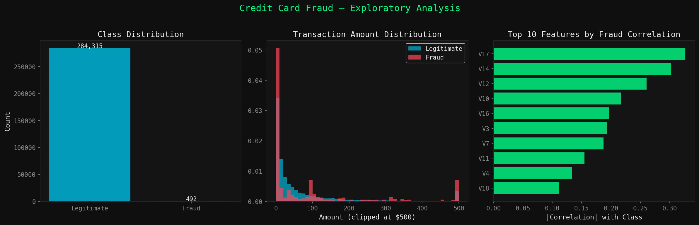
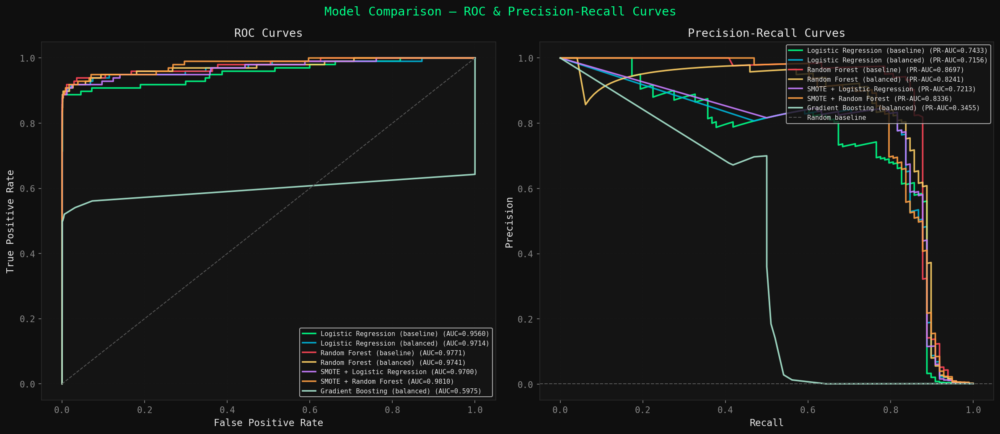
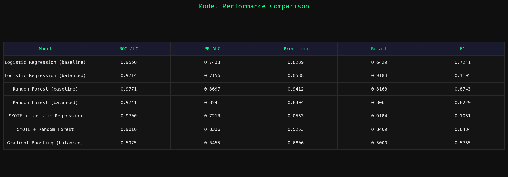
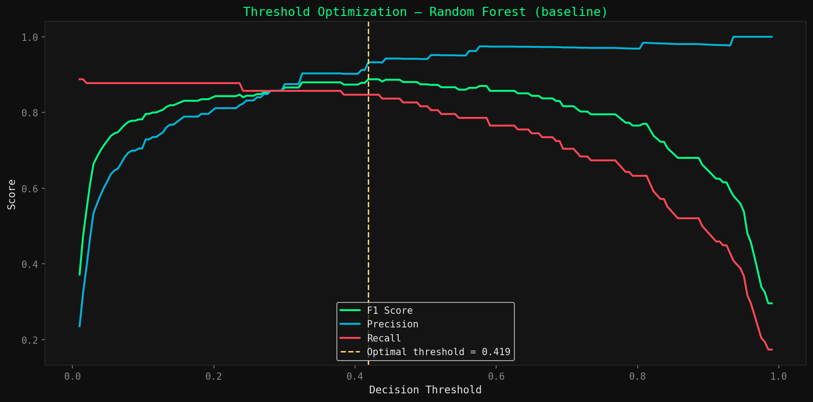
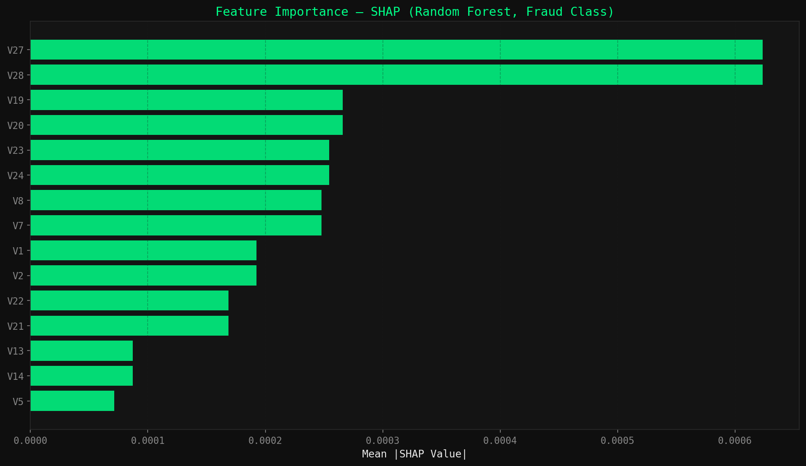
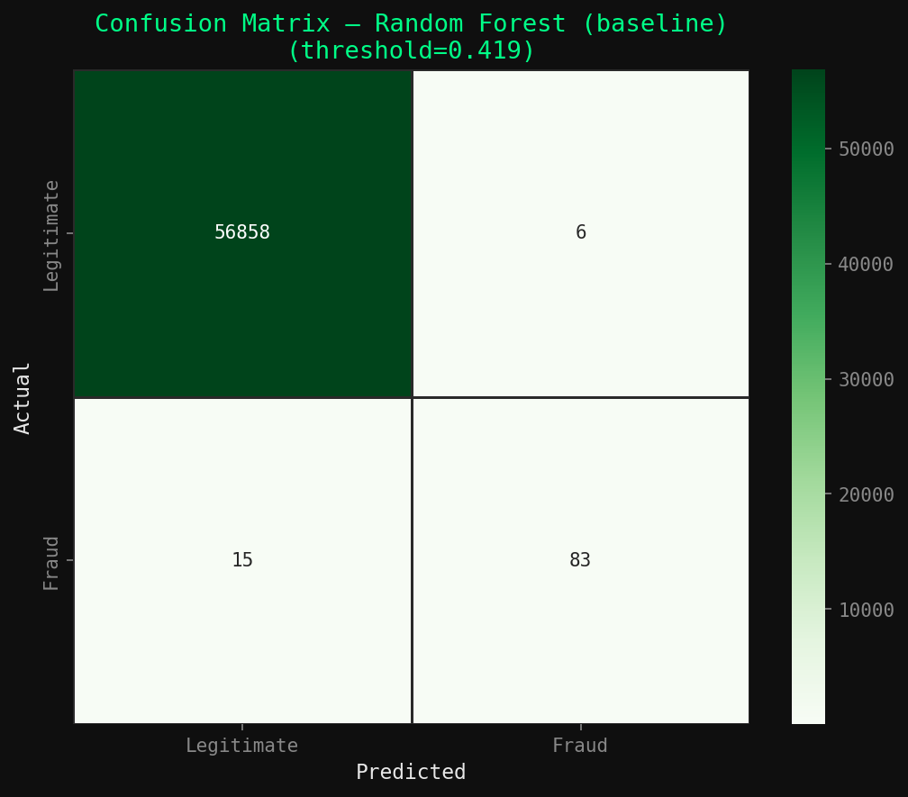

# Fraud Detection with Imbalanced Learning

End-to-end machine learning pipeline for credit card fraud detection on a severely imbalanced dataset (0.17% fraud rate). Compares 7 model configurations across baseline, class-weighting, and SMOTE oversampling strategies — evaluated on metrics that actually matter under imbalance.

---

## The Problem

Standard accuracy is useless here. A model that predicts "legitimate" for every transaction achieves 99.83% accuracy while catching zero fraud. This project focuses on PR-AUC, ROC-AUC, and threshold-optimized F1 — the metrics that drive real fraud prevention decisions.

---

## Results

| Model | ROC-AUC | PR-AUC | F1 |
|-------|---------|--------|----|
| Random Forest (baseline) | 0.9771 | 0.8697 | 0.8743 |
| SMOTE + Random Forest | 0.9810 | 0.8336 | 0.6484 |
| Random Forest (balanced) | 0.9741 | 0.8241 | 0.8229 |
| Logistic Regression (baseline) | 0.9560 | 0.7433 | 0.7241 |
| SMOTE + Logistic Regression | 0.9700 | 0.7213 | 0.1061 |
| Logistic Regression (balanced) | 0.9714 | 0.7156 | 0.1105 |
| Gradient Boosting (balanced) | 0.5975 | 0.3455 | 0.5765 |

**Best model:** Random Forest (baseline) at optimal threshold of 0.419 — Precision: 93.3% · Recall: 84.7% · F1: 88.8%

**Key finding:** The baseline Random Forest outperforms SMOTE on F1 while being significantly faster to train. Class imbalance is better handled through threshold optimization than oversampling for this dataset.

---

## Visualizations

> All plots are generated automatically when you run the pipeline. See files in this repo.

**EDA — Class Distribution, Amount Distribution, Feature Correlations**



**ROC and Precision-Recall Curves — All 7 Models**



**Model Performance Comparison Table**



**Decision Threshold Optimization**



**SHAP Feature Importance**



**Confusion Matrix — Best Model at Optimal Threshold**



---

## Run It

```bash
# 1. Download the dataset from Kaggle
# kaggle.com/datasets/mlg-ulb/creditcardfraud
# Place creditcard.csv in this directory

# 2. Install dependencies
pip install -r requirements.txt

# 3. Run the full pipeline
python fraud_detection_analysis.py
```

All 6 plots will save automatically to this directory.

---

## What This Demonstrates

- Handling real-world class imbalance (284,807 transactions, 492 fraud cases)
- Proper evaluation under imbalance: PR-AUC over accuracy, ROC curves, confusion matrices
- Decision threshold optimization for business-specific precision/recall tradeoffs
- SHAP-based model explainability identifying which features drive fraud predictions
- Clean modular ML pipeline with reproducible results

---

## Stack

Python · scikit-learn · imbalanced-learn · SHAP · pandas · NumPy · matplotlib · seaborn

---

## Dataset

Kaggle Credit Card Fraud Detection — 284,807 transactions, 492 fraud cases (0.172%). Features V1–V28 are PCA-transformed for confidentiality.

---

## Author

**Elijah Legall** · Penn State Data Science · [GitHub](https://github.com/elifloss) · [LinkedIn](https://linkedin.com/in/elijah-legall)
